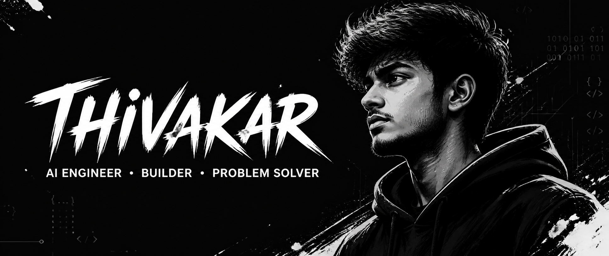

  

   

  
  
  

 

<h2 align="center">Know About Me</h2>

Hey, I'm **Thivakar**.

I'm an AI-focused developer who enjoys turning ideas into practical software. My interests sit around intelligent systems, secure applications, computer vision, and creative 3D workflows.

I learn by building, testing, and shipping.

 

---

<h2 align="center">Top Projects</h2>

**[`CODE GUARDIAN`](https://github.com/Thivakar101/code-vulnerability-guardian)** 
Local AI-assisted source-code security analysis.

**[`ARCSIGHT 3D`](https://github.com/Thivakar101/arcsight3d)** 
From architectural floor plans to explorable 3D scenes.

**[`TEXTURE LAB`](https://github.com/Thivakar101/ai-texture-generator-)** 
AI-assisted texture generation for 3D workflows.

 

---

<h2 align="center">Build With</h2>

  <code>Python</code>&nbsp;&nbsp;
  <code>Java</code>&nbsp;&nbsp;
  <code>Flask</code>&nbsp;&nbsp;
  <code>AI / ML</code>&nbsp;&nbsp;
  <code>Computer Vision</code>&nbsp;&nbsp;
  <code>Docker</code>&nbsp;&nbsp;
  <code>Blender</code>

---

<h2 align="center">Connect</h2>

  
  

  <i>Build with curiosity. Ship with purpose.</i>

---

<h2 align="center">Contribution</h2>

  

  Minimal line-art stickers from <a href="https://phosphoricons.com/">Phosphor Icons</a> via <a href="https://iconify.design/">Iconify</a>.

